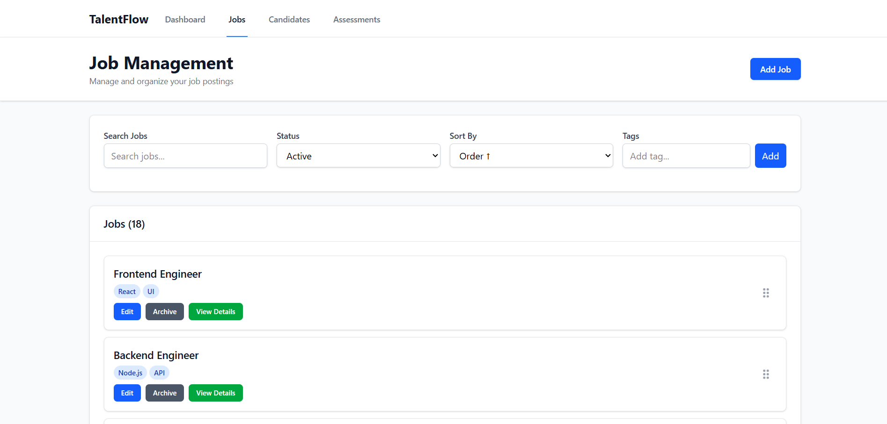
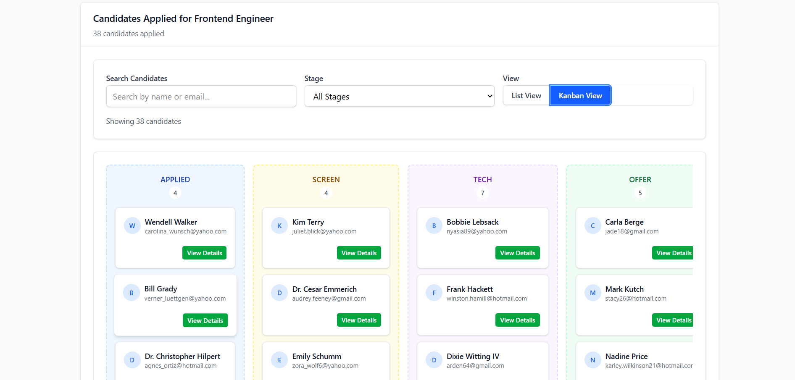
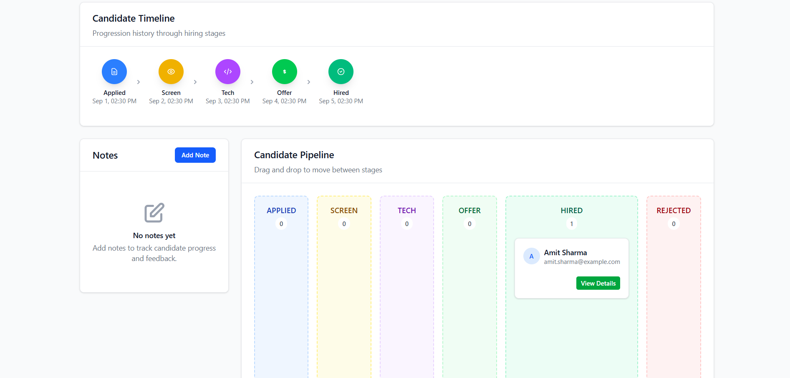
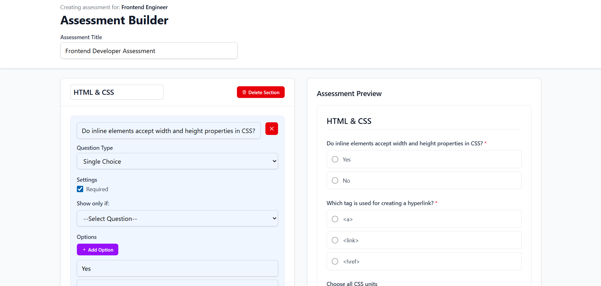
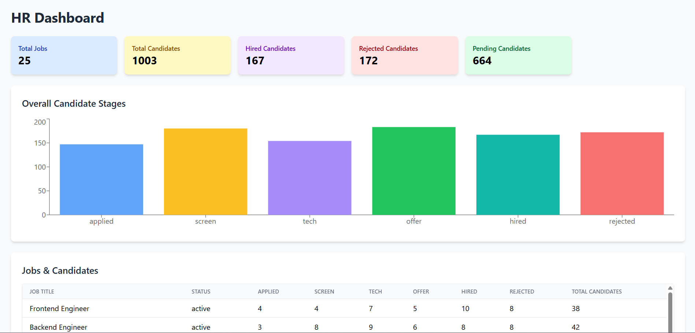

# Talentflow – A MINI HIRING PLATFORM

This is a React application built with Vite that serves as a talent management system. It features a jobs board, candidate management, and a tool to build custom assessments for job applications. The application uses a mock backend powered by MirageJS to simulate API interactions without a real server.

## Table of Contents

1. [Setup](#setup)  
2. [Architecture](#architecture)  
3. [Technical Decisions](#technical-decisions)  
4. [Core Flows Implementation](#core-flows-implementation)  
5. [Issues](#issues)  


-----

## Setup

To get a local copy up and running, follow these simple steps.

### Prerequisites

  * Node.js (version 20.19.0 or higher)

### Installation

1.  Clone the repository:
    ```bash
    git clone https://github.com/abhayksahu369/entnt-assignment-talentflow.git
    ```
2.  Navigate to the project directory:
    ```bash
    cd entnt-assignment-talentflow
    ```
3.  Install dependencies:
    ```bash
    npm install
    ```
4.  Run the development server:
    ```bash
    npm run dev
    ```

The application will be available at the URL provided in your terminal (usually `http://localhost:5173`).

-----

## Architecture

The project follows a standard React application structure, leveraging Vite for a fast development experience. It utilizes a component-based approach with a dedicated `src` directory containing all the source code.

### Folder Structure

```
entnt-assignment-talentflow/
├── public/
│   ├── _redirects
│   └── talentflow.svg
├── src/
│   ├── components/
│   │   ├── AssessmentPreview.jsx
│   │   ├── CandidatesList.jsx
│   │   ├── CandidatesView.jsx
│   │   ├── KanbanBoard.jsx
│   │   ├── Loader.jsx
│   │   └── Navbar.jsx
│   ├── modals/
│   │   ├── CreateCandidateModal.jsx
│   │   ├── CreateJobModal.jsx
│   │   └── EditJobModal.jsx
│   ├── pages/
│   │   ├── AllAssessmentPage.jsx
│   │   ├── AssesmentBuilderPage.jsx
│   │   ├── AssessmentPreviewPage.jsx
│   │   ├── CandidateDetails.jsx
│   │   ├── CandidatesPage.jsx
│   │   ├── Dashboard.jsx
│   │   ├── Home.jsx
│   │   ├── JobDetails.jsx
│   │   └── NoPageFound.jsx
│   ├── server/
│   │   └── server.jsx
│   ├── App.jsx
│   ├── index.css
│   └── main.jsx
├── .gitignore
├── eslint.config.js
├── index.html
├── package-lock.json
├── package.json
└── vite.config.js
```

### Frontend Routing Architecture

The application's navigation is managed using **react-router-dom**, defining a clear and intuitive flow for the user. The primary routes are nested within the main `App.jsx` component, each corresponding to a specific page or functionality.

#### Route Structure

* `/`

  * **Component:** `Home.jsx`
  * **Purpose:** The main job board, where users can view, filter, sort, and reorder all job postings.

* `/dashboard`

  * **Component:** `Dashboard.jsx`
  * **Purpose:** A high-level overview of key HR metrics, including candidate counts and stage distribution.

* `/job/:id`

  * **Component:** `JobDetails.jsx`
  * **Purpose:** Displays detailed information for a specific job posting, including the Kanban board for managing its candidates.

* `/candidates`

  * **Component:** `CandidatesPage.jsx`
  * **Purpose:** A central hub to view and manage all candidates across all jobs, with filtering and search capabilities.

* `/candidate/:id`

  * **Component:** `CandidateDetails.jsx`
  * **Purpose:** Presents a detailed profile for an individual candidate, including their stage timeline and a notes section.

* `/allassessments`

  * **Component:** `AllAssessmentPage.jsx`
  * **Purpose:** Lists all available assessments and provides a way to create new ones for a selected job.

* `/assessmentbuilder/:jobId`

  * **Component:** `AssesmentBuilderPage.jsx`
  * **Purpose:** A dedicated interface for building or editing an assessment, with a live preview.

* `/assessmentpreview/:jobId`

  * **Component:** `AssessmentPreviewPage.jsx`
  * **Purpose:** Shows a fillable, static preview of an assessment for a specific job, complete with validation and conditional logic.

* `*` (wildcard)

  * **Component:** `NoPageFound.jsx`
  * **Purpose:** A fallback route to display a custom 404 page for any URL that doesn't match a defined path.

### Key Technologies

* **Frontend:** The UI is built using **React** with a component-based architecture.
* **Styling:** **Tailwind CSS** is used for utility-first styling, configured via `vite.config.js` and included in `index.css`.
* **Routing:** **React Router DOM** manages the application's navigation, defining routes for the dashboard, job and candidate details, and assessment pages in `App.jsx`.
* **Mock Backend:** A mock API is set up using **MirageJS** to simulate server-side data persistence and API endpoints, allowing the frontend to function independently of a real backend. It uses **Dexie.js** for persistence, providing a robust and scalable way to store a large amount of data locally. The mock server is initialized in `main.jsx` and defined in `server/server.jsx`.


-----

## Technical Decisions

* **React + Vite:** Chosen for fast hot module replacement (HMR) and an efficient development workflow.
* **Tailwind CSS:** A utility-first CSS framework used for rapid and consistent styling throughout the application.
* **MirageJS and FakerJS:** MirageJS is used to simulate a backend, while FakerJS is utilized within it to seed the mock database with a large number of realistic job and candidate data, enabling a robust development environment. The API is also configured with an artificial latency and a simulated error rate on write endpoints to better replicate real-world conditions.
* **Data Persistence with Dexie:** The mock data is persisted using Dexie.js, a wrapper for IndexedDB. This provides a robust and scalable way to store a large amount of data locally. The data is seeded on the first visit and then loaded from IndexedDB on subsequent refreshes, ensuring continuity.
* **React-Toastify:** The react-toastify library is integrated to provide clear and user-friendly notifications for various actions, improving the overall user experience.
* **Drag-and-Drop:** The dnd-kit library is used for implementing drag-and-drop functionality for reordering jobs on the main board (Home.jsx) and moving candidates between stages on the Kanban board (KanbanBoard.jsx).
* **Virtualized Lists:** For the candidate lists, @tanstack/react-virtual is used in CandidatesList.jsx to efficiently render large datasets (over 1000 candidates), improving performance by only rendering visible items.


-----

## Core Flows Implementation

### 1\. Jobs Board

**Implementation Details:**

  * **List with pagination and filtering:** The main job board (`Home.jsx`) displays jobs with filtering for title, status, tags, and sorting. The filtering, sorting, and pagination are handled by the server using query parameters.
  #### Job Board Screenshot

  * **Create/Edit Job:** Jobs can be created or edited via dedicated modals (`CreateJobModal.jsx` and `EditJobModal.jsx`). Form validation ensures that the job title is not empty and at least one tag is added.
  * **Archive/Unarchive:** The job status can be toggled using a patch request to the mock API in `Home.jsx`.
  * **Reorder via drag-and-drop:** Drag-and-drop reordering is implemented in `Home.jsx` using `DndContext` and `SortableContext` from `dnd-kit`. The implementation includes optimistic updates, where the UI is updated immediately, and a rollback mechanism is in place to revert changes if the mock API call fails.


    

### 2\. Candidates

**Implementation Details:**

  * **Virtualized List:** The main candidates page (`CandidatesPage.jsx`) uses `@tanstack/react-virtual` to render a list of over 1000 candidates efficiently. Filtering is handled on the client-side for name/email and server-side for stage.
  * **Candidate Profile:** A deep link to a candidate's profile (`/candidate/:id`) is supported, displaying their timeline of stage changes.
  * **Kanban Board:** The `KanbanBoard.jsx` component allows dragging and dropping candidates between different hiring stages (`applied`, `screen`, `tech`, `offer`, `hired`, `rejected`). This is particularly useful on the **Job Detail page**, where the Kanban board makes it easy to visualize and manage candidates for a specific job, and the board can also be filtered by stage. It is also used on the **Candidate Detail page** to manage an individual candidate’s pipeline across different stages. The component handles the API call to update the candidate's stage with an optimistic UI update and a rollback on failure.

#### Kanban Board in Job Detail Page
  
#### Kanban Board in Candidate Detail Page
  

  * **Notes with @mentions:** On the candidate detail page, a notes section allows adding notes. When typing, suggestions for team members appear when you type `@`. The notes are stored and rendered with the mentions highlighted, but this is a purely local implementation.

### 3\. Assessments

**Implementation Details:**

  * **Assessment Builder:** The `AssesmentBuilderPage.jsx` provides an interface to create and edit assessments. Users can add sections and various question types, including single-choice, multi-choice, short/long text, numeric, and file uploads. The state of the builder is persisted to local storage to prevent data loss during page reloads.
  * **Live Preview:** A live preview component (`AssessmentPreview.jsx`) shows the assessment as a fillable form, allowing the builder to see exactly what a candidate will experience. This component also handles the form submission and validation logic.

    
  
  * **Form Validation and Conditional Questions:** The preview component handles validation rules for required questions, numeric ranges, and max lengths. It also supports conditional logic, displaying questions only when a specific answer is selected for a preceding question.
#### Conditional Question Flow (Follow-up Triggered by "No")


### 4\. Dashboard

**Implementation Details:**

  * **Key Performance Indicators (KPIs):** The `Dashboard.jsx` page provides a summary of total jobs, total candidates, and the number of hired, rejected, and pending candidates. This gives HR a quick overview of the hiring process at a glance.
  
  * **Candidate Stage Chart:** A bar chart generated using the `recharts` library visually represents the number of candidates at each stage of the hiring pipeline, helping to quickly identify bottlenecks or progress trends.
  
  * **Detailed Table:** A table breaks down the number of candidates per stage for each individual job, providing a comprehensive view of the hiring process and enabling HR to analyze job-specific performance.
  
  

-----

## Issues

* **No User Authentication or Authorization:** The platform lacks a real authentication system. All user interactions assume a single user and there are no access controls.
* **Lack of Centralized State Management:** The project uses a mix of component-level state and props. For a larger application, this could become difficult to manage and a dedicated state management library might be necessary.
* **Lack of Responsiveness for Complex Components:** Some complex components like KanbanBoard.jsx are designed with horizontal scrolling for a large number of columns but may not be fully optimized for all screen sizes or mobile devices. A more refined responsive design would be needed.
* **Assessment Builder Validation:** The assessment builder itself lacks validation for the questions and options being created. This could allow users to create an assessment with invalid data, such as a question with no text or a numeric question with non-numeric validation rules. Adding validation to the builder would prevent malformed assessments from being created.
